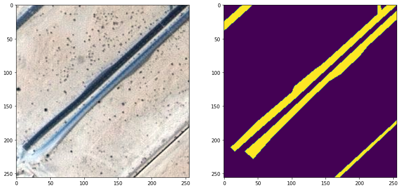

# Segmentation of Arial Images

Aerial imagery, obtained by MBRSC satellites, is classified using annotated semantic 
segmentation in six classes through the implementation of UNet architecture neural 
networks. The training performance is enhanced through the application of various 
data augmentation techniques for image transformation. The evaluation of performance is carried out using loss function, dice coefficient, and accuracy measures.

The dataset can be reached [here](https://humansintheloop.org/resources/datasets/semantic-segmentation-dataset/).


## Building Machine Learning Web Apps using Gradio in Python

Gradio has been employed in this work to construct a web application in order to facilitate user interaction. Gradio is a Python-based library available as open source, which facilitates the creation 
of demos and web applications for machine learning and data science projects. Using 
Gradio, you can promptly develop an attractive user interface for your machine learning 
models or data science workflow, allowing individuals to experiment with it by dragging 
and dropping their images, pasting text, recording their voice, and interacting with the 
demo, all in a browser.

Gradio has several practical applications such as **Demoing**, **Deploying**, and 
**Debugging** which facilitate:

- Demonstrating your machine learning models to clients, collaborators, users, or 
students.
- Rapidly deploying your models through auto-generated links and obtaining feedback 
on model performance.
- Debugging your models interactively during the development stage using integrated 
manipulation and interpretation tools.

**Gradio** enables the creation of interactive applications that permit your team members or users to test your machine learning model, API, or data science workflow within their browsers. This is one of the most effective approaches to sharing your work with others.

Gradio can be install using this line:

```bash
pip install gradio
```
To obtain comprehensive guidance on how to utilize this tool, refer to 
the [Gradio Github Page](https://github.com/gradio-app/gradio/). 

# Examples, results and comparison

Here is an example of an image and the corresponding label:





Comarison of the predection results with masked and original images:


Loss function history:


Intersection over Union history:


